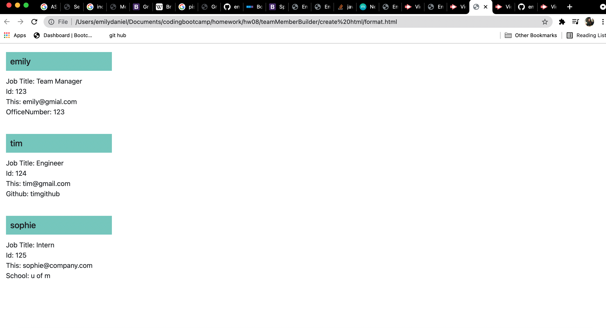

# Team Member Builder

## description 
This app allows the user to dynamically add team members to their team through Inquierer. It asks the user for the name of the employee, their ID, their email and their job title. Depending on the job title chosen, (team manager, engineer or intern), they are asked either about their office number, their github link or their school name. They are then asked if they want to add a new employee. Once the user has added all the employees they wish, this information is sent to an html page that is styled, and will now display the team members added by the user.

## Screenshot

## Links

https://github.com/emilyelizabethdaniel
